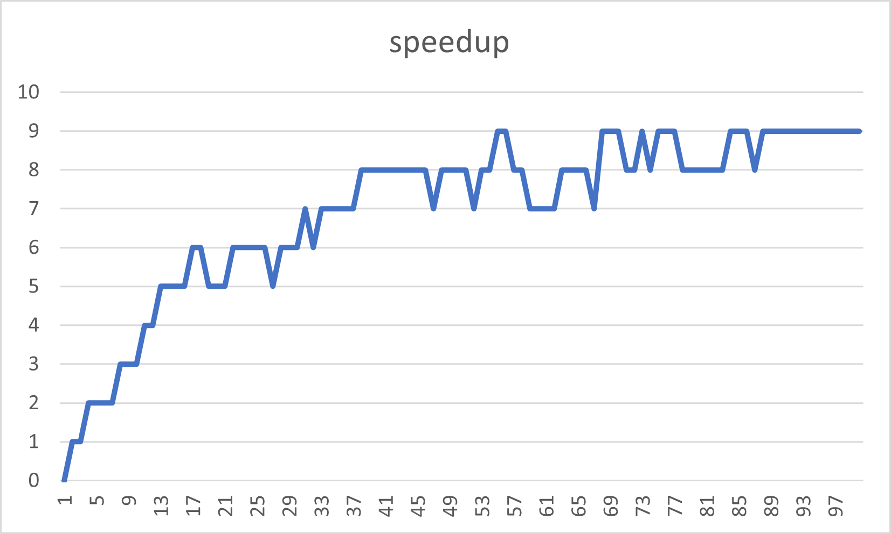

# Mandelbrot

This is a university project to practice parallel programming concepts.

## Usage

You have to pass the following command line arguments:

1. width of image
2. height of image
3. minX of the viewPort
4. minY of the viewPort
5. maxX of the viewPort
6. maxY of the viewPort
7. maxIterations

**Example:**
ParallelMandelbrot.exe 1024 1024 -2 -1 1 1 300

## Implementation

There are 2 methods **mandelbrot** and **parallelMandelbrot**, which are defined in **mandelbrot.h**.

### ParallelMandelbrot

I decided to use a static scheduler due to the fact that the time for each iteration will not differ by a lot. And also
I need to know the exact chunk sizes so I can put together the image accordingly.  
In **parallelMandelbrot** I use **#pragma omp parallel firstprivate(window, viewPort, maxIterations)** to start parallel
execution. in this block I split the pixels to compute according to the **REAL** number of threads I got from the
system. I then initialize a thread-local vector to store the computed pixels which I compute in a parallel for-loop.
After computing all the bytes I push the thread-local vector into a global vector at index: **id of the thread**. Using
the id for distributing chunks of work and pushing to the global vector helps me to ensure that the image gets set back
together in the right order, which is exactly what I do next **outside** of the parallel block. Lastly I save the image.

## Comparison Sequential and Parallel Solution

In main.cpp I have commented out the code I used to roughly measure the difference in performance. The comparison uses
the parameters mentioned as example: **1024 1024 -2 -1 1 1 300**. I executed both methods 100 times and compared the
average runtimes in ms:

| sequential | parallel (20 threads) | Speedup |
| --- | --- | --- |
|  633 ms | 85 ms | 7.45 |

## Speedup Quotient
In main.cpp I also added a simple generation for a .csv file containing the speedup quotient from 1 to 100 threads.
Note that I only executed the average for 10 executions for each number of threads!
I then used this to generate the following graphs:

")

